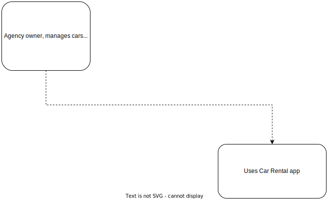

# Car rental application

This is a car rental application developed with Node.js, Express, sqlite3 and Bulma.

Current functionality includes a CRUD (Create, Read, Update, Delete) system for efficient vehicle management. There will be a rental system feature coming soon that will allow users to rent cars.

Extensive testing has been performed using Jest and Cypress with a dedicated testing database.

## Key Scripts

- `start`: Start the application
- `dev`: Start the application in development mode
- `test:all`: Run tests with Jest and Cypress

## Diagrams

| L1 diagram |
|:---:|
|  |
---
| L2 diagram |
|:---:|
|  |
 ---
| L3 diagram |
|:---:|
|  |


## Other Scripts

- `test`: Run tests with Jest
- `test:failures`: Run only failed tests with Jest
- `test-watch`: Run Jest in watch mode
- `clear-jest-cache`: Clear Jest cache
- `start:test`: Start the application in test mode

## Project Setup

Follow these steps to set up the project locally:

1. **Clone the repository**: First, clone the repository to your local machine. If you have GitHub Desktop installed, click on the `Code` button on the main page of the repository, then choose `Open with GitHub Desktop`. Follow the prompts in GitHub Desktop to complete the clone.

   If you don't have GitHub Desktop, you can download the repository as a ZIP file. Click on the `Code` button, then select `Download ZIP`. Once the ZIP file is downloaded, extract it to your desired location.

2. **Install Dependencies**: Navigate into the cloned repository and install the necessary dependencies using `npm install`.

```bash
cd Car-rental
npm install
```

3. **Environment Variables**: Rename the .env.dist file to .env 
    This file contains the environment variables necessary for running the application.

4. **Start the application**: Run the `start` script to start the application.

```bash
npm run start
```

    

    OR
    
5. **Start the application in development mode**: Run the `dev` script to start the application in development mode.

```bash
npm run dev
```
  OR

6. **Start the application in test mode**: Run the `test:all` script to start the application in test mode.

```bash
npm run test:all
```

## Testing

This application is thoroughly tested with both unit tests and end-to-end tests to ensure its reliability and stability.

You can follow these steps to run the tests:

1. **Run unit tests**: Run the `test` script to run the unit tests.

```bash
npm run test
```

2. **Run unit tests + end-to-end tests**: Run the `test:all` script to run the end-to-end tests.

```bash
npm run test:all
```

## API Endpoints

- `GET /`: Displays the home page.
- `GET /cars`: Displays a list of all cars.
- `GET /admin/dashboard`: Displays the admin dashboard.
- `GET /admin/edit_car/:id`: Displays the form to edit a specific car.
- `GET /admin/add`:Displays the form to add a new car.
- `PATCH /admin/edit_car/:id`: Receives the data from the edit car form and updates the specific car.
- `POST /admin/add`: Receives the data from the add car form and creates a new car.
- `DELETE /admin/delete_car/:id`: Deletes a specific car.
- `POST /logout`: Logs out the current user.

## Version

1.0.0

## Main File

app.js

## Author

Joaquin

## License

ISC
